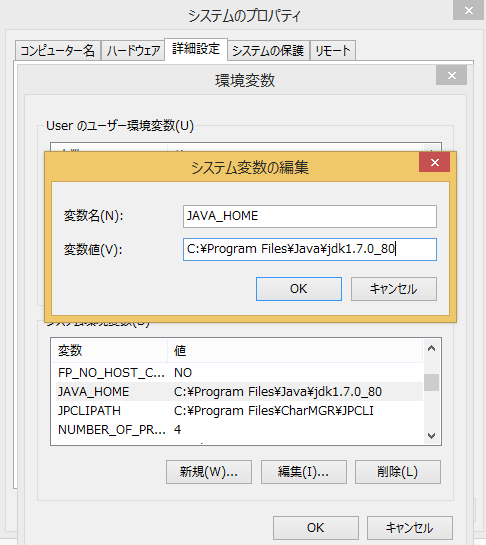
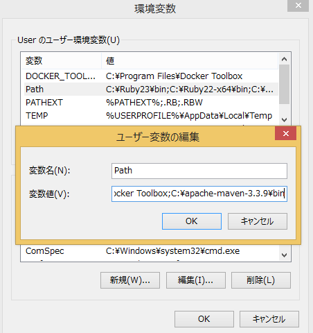

# Making Maven project work in offline mode

### 1. JDK and JAVA_HOME
First of all, make sure **JDK is installed**, and **“JAVA_HOME” variable is added as Windows environment variable**.
  
You can set environment variable for JAVA_HOME. If you are using Windows 8, you can find it by going to 
```
Start -> All Apps -> Control panel -> System -> Advanced System Settings -> Advanced -> Environment variables.
```

### 2. Download Apache Maven
You need to download the apache-maven from Apache Maven Project.
Visit [Maven official website](https://maven.apache.org/download.cgi), download the Maven zip file, for example : apache-maven-3.3.9-bin.zip. Unzip it to the folder you want to install Maven.
Assume you unzip to this folder – C:\maven


Open settings.xml  under the conf folder (C:\apache-maven-3.3.9\conf) and edit it like below
```
<localRepository>C:\Users\User\.m2\repository</localRepository>
```

### 3. Add To PATH
Update **PATH variable in user variables**, add this C:\apache-maven-3.3.9\bin to your path in user variables so that you can run the Maven’s command.  


### 4. Verification
Done. To verify it, run following command in the command prompt for mvn -version.
```
mvn -v
```
If you see a similar message below, means the Apache Maven is installed successfully on Windows.
```
C:\>mvn -v
C:\
Apache Maven 3.3.9 (bb52d8502b132ec0a5a3f4c09453c07478323dc5; 2015-11-10T23:11:4
7+06:30)
Maven home: C:\apache-maven-3.3.9\bin\..
Java version: 1.7.0_80, vendor: Oracle Corporation
Java home: C:\Program Files\Java\jdk1.7.0_80\jre
Default locale: ja_JP, platform encoding: MS932
OS name: "windows 8.1", version: "6.3", arch: "amd64", family: "windows"
```

### 5. Download all the required dependencies and plugins.
Run the following command to download all the required dependencies and plugins for the project based on your pom file:
```
mvn dependency:go-offline
```

To observe that the build is completed successfully without any network connection, run the following command: 
```
mvn –o clean package
```
***-o*** option for offline command.

**or** you can open settings.xml under the {user.home}/.m2/ and edit it like below to build offline instead of running **mvn –o clean package**.  
```
<settings xmlns="http://maven.apache.org/SETTINGS/1.0.0" xmlns:xsi="http://www.w3.org/2001/XMLSchema-instance"
          xsi:schemaLocation="http://maven.apache.org/SETTINGS/1.0.0 http://maven.apache.org/xsd/settings-1.0.0.xsd">
<offline>true</offline>
</settings>
```
This ***<offline>true</offline>*** determines whether maven should attempt to connect to the network when executing a build.  
This will have an effect on artifact downloads, artifact deployment, and others.  
You set it permanently in the Maven settings file settings.xml.  
[Settings Details - Maven](http://maven.apache.org/settings.html#Settings_Details)  

**or** you can simply run your NetBeans without internet connection instead of running **mvn –o clean package**.


### 6. Get the DHCP server

You need to get DHCP server to make server and client communicate with each other.  
For example, I set internet sharing on my phone to share the data connection with my computet.  
Once I connect my computer to Internet using my phone's internet connection, set no data connection on my phone.  
After that, reboot your Tera Term by running following command.
```
sudo reboot
```
You can see it is offline by using Ping command on command prompt and go to some websites (e.g. ping google.com) 
